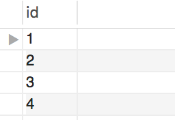

# Joins Are From Descartes, Rows Are From Schemas


### Part 1

* The outputs of following queries are 25 and 10, respectively.

  ```sql
  SELECT COUNT(*)
  FROM first_table;

  SELECT COUNT(*)
  FROM second_table;
  ```

* What will be the number of rows in the output of the following query?

  ```sql
  SELECT *
  FROM first_table, second_table;
  ```  

#*The answer is 250 25 rows x 10 rows from the second table 

### Part 2

* The query `SELECT * FROM table_one;` returns the following:

  

* And the query `SELECT * FROM table_two;` returns the following:

  

* What will the query `SELECT * FROM table_one, table_two;` look like?

#*** The result is 12 rows with each row in the first table 1,2,3,4 matched with the 10, 11, 12 in the second tables rows as below: 
    1,10;
    1,11;
    1,12;
    2,10;
    2,11;
    2,12;
    3,10;
    3,11;
    3,12;
    4,10;
    4,11;
    4,12

* _You can use pgAdmin and create a new table to test out this activity_
